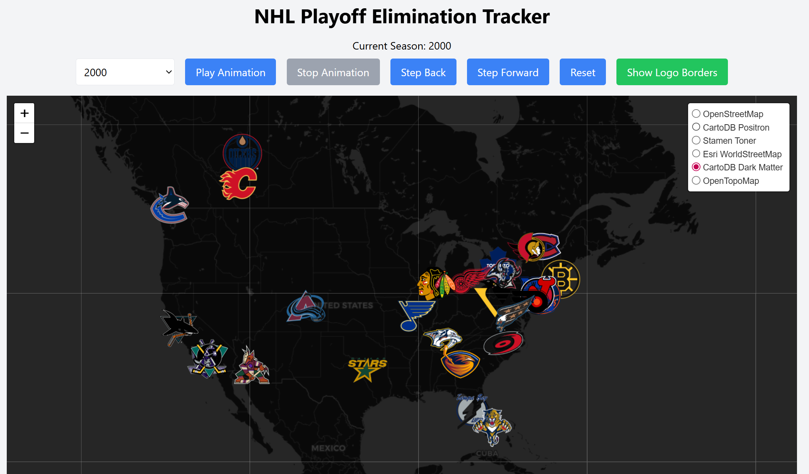

# NHL Playoff Elimination Tracker

This interactive web app visualizes the progression of NHL playoff eliminations for any season from 1967 through 2025. It features a geographic display of all NHL teams, with logos positioned based on team location and animated in elimination order based on historical results — including both regular season and postseason outcomes.

Designed for fans, analysts, and historians, this project offers a unique way to explore how the Stanley Cup Playoffs unfolded across decades of NHL history.

### 📸 NHL Playoff Elimination Tracker – Screenshot



---

## Features

- **Season Selector**  
  Instantly switch between any NHL playoff season from 1967 to 2025.

- **Elimination Sequence Visualization**  
  Teams are animated off the display in the order they were eliminated, with same-day eliminations handled simultaneously. Sequences reflect both regular season playoff eliminations and postseason results.

- **Location-Based Logo Placement**  
  Logos for each team are accurately placed based on geographic coordinates (latitude and longitude). A map background is currently in development.

- **Era-Accurate Logos**  
  Each season uses historically accurate team logos reflecting the branding used during that year.

---

## Project Structure

```plaintext
.
├── index.html                # Main web app (self-contained)
├── data/
│   ├── team_coordinates.json  # Latitude/longitude for each franchise
│   └── NHLelimseq.json        # Elimination sequence data for all seasons
├── logosNHL/
│   ├── NHL1967/
│   ├── NHL1968/
│   ├── ...
│   └── NHL2025/              # One folder per season with era-accurate logos
└── README.md


---

## Data Sources

- **Team Coordinates**  
  Manually curated geographic data for NHL franchises, accounting for relocations, name changes, and expansion history.

- **Elimination Sequences**  
  A single JSON file (`NHLelimseq.json`) provides the elimination order for every NHL team in each season from 1967 to 2025. These sequences reflect both regular season eliminations (i.e., teams that failed to qualify) and playoff losses.  
  All sequences were **manually verified** by reviewing daily standings across many seasons — especially during the final weeks of the regular season — to ensure historical accuracy.

- **Logos**  
  Each season’s folder contains the official team logos used in that year, providing an authentic visual context. Logos are chosen to reflect the look and feel of each era.

---

## Goals

This project is part of the [Elevation Edge Sports Data](https://github.com/elevation-edge-sports-data) portfolio, which explores the intersection of sports analytics, historical storytelling, and interactive design.

Future goals include:
- Adding a stylized North American map as the background layer
- Full support for elimination animation playback
- Shareable recaps and season videos
- Enhanced mobile experience and accessibility
- Additional overlays (e.g., series results, scores, or rivalries)

---

## Disclaimer

This is a personal project for educational and portfolio purposes. NHL logos are used under fair use for historical and illustrative purposes only. All trademarks and intellectual property belong to their respective owners.
