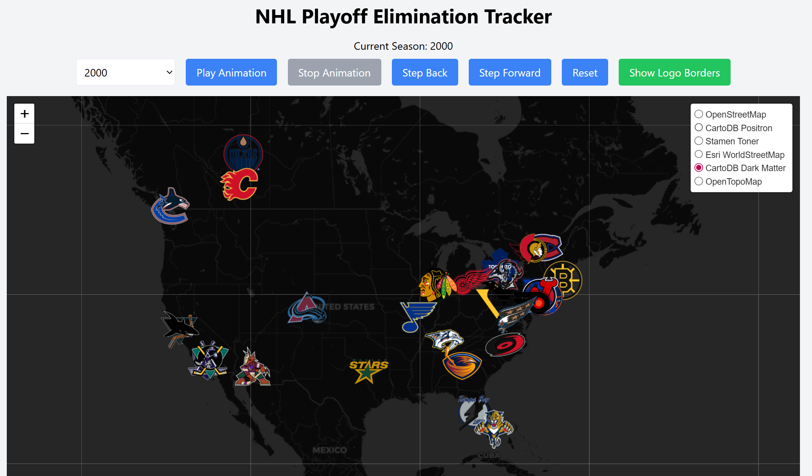

# NHL Playoff Elimination Tracker

An interactive web application that visualizes NHL Stanley Cup Playoff eliminations in sequence across every season from 1918 to 2026.

## Features

- Interactive web application built with HTML, TailwindCSS, JavaScript, React, and Leaflet.js
- Visualizes over a century of NHL playoff history through an interactive map
- Animated playoff elimination sequence with step, play, pause, and reset controls
- Customizable map backgrounds
- Uses season-specific team logos matching the selected NHL season
- Displays teams using geographically accurate home arena locations


## Screenshot



## Live Demo

Explore the interactive application:

[https://elevation-edge-sports-data.github.io/nhl-playoff-elimination-tracker/](https://elevation-edge-sports-data.github.io/nhl-playoff-elimination-tracker/)

## Project Structure 

```text
nhl-playoff-elimination-tracker/
├── index.html               # Main landing page with team directory
├── script.js                # Powers interactivity on index and team pages
├── styles.css               # Controls layout, colors, fonts, and responsiveness
├── data/                    # Project datasets
│   ├── NHLelimseq.json      # Historical playoff elimination sequence data
│   └── team_coordinates.json # Geographic coordinates for NHL teams
├── logos/                   # Historical team logos for each NHL season
│   ├── NHL1918/
│   ├── ...
│   └── NHL2026/
├── .nojekyll                # Disables GitHub Pages Jekyll processing
├── screenshot.png           # Application screenshot
└── README.md                # Project documentation
```

## License

Open source project.

Produced by Zach Sajevic (2025)
