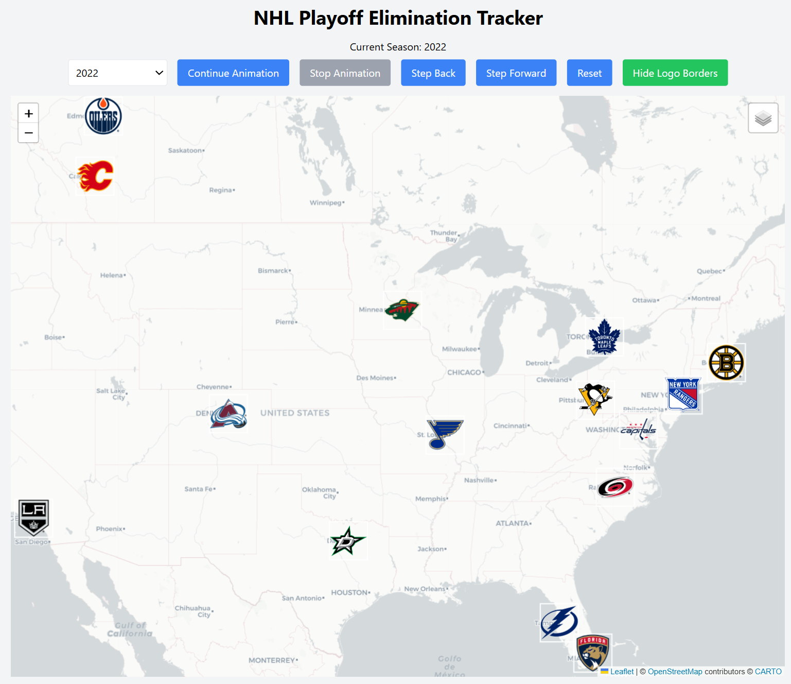

# NHL Playoff Elimination Tracker

An interactive web app that visualizes playoff eliminations from each NHL season.

## Features

- Simple, responsive front-end built with HTML, TailwindCSS, JavaScript, React, and Leaflet.js  
- Fully client-side implementation with no backend or build tools  
- Covers all NHL seasons from 1918 to 2025  
- Logos are positioned geographically using real-world coordinates  
- Era-accurate logos for each team based on the selected season  
- Interactive elimination animations with step, play, stop, and reset controls  
- Optional map background layers and logo styling toggles

## Screenshot

## Live Demo

The app is deployed via GitHub Pages: 

https://elevation-edge-sports-data.github.io/nhl-playoff-team-stats/

## Local Usage

To run the app locally:

1. Clone the repository:

git clone https://github.com/elevation-edge-sports-data/nhl-playoff-team-stats.git

2. Open `index.html` in your browser.  
No build step or backend is required; all content is static and client-side.

## Project Structure 

nhl-playoff-elimination-tracker/
├── index.html # Main landing page with team directory
├── script.js # Powers interactivity on index and team pages
├── styles.css # Controls layout, colors, fonts, and responsiveness
├── data/     # Historical team logos for each NHL season
│   ├── NHLelimseq.json # 
│   └── team_coordinates.json #
├── logos/     # Historical team logos for each NHL season
│   ├── NHL1918/
│   ├── ...
│   └── NHL2026/
├── .nojekyll/ # No Jekyll File
├── screenshot.png/ # App screenshot
└── README.md # This documentation

## License

This project is open-source and freely available for personal or educational use.

Produced by Zach Sajevic (2025)
