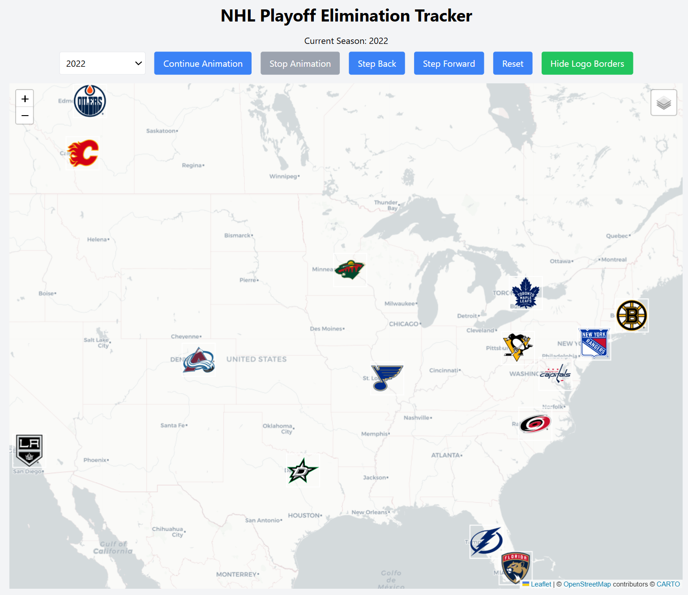

# NHL Playoff Elimination Tracker — v1 archive

Frozen copy of the original Leaflet map (1918–2026 arena logos, play/pause/step).

This folder is served at `/archive/v1/`. Season logos are reused from the v2 tree at `/logos/` (`../../logos` from this page).

The current Cup Territory app is v2 at the site root.

## Original README

An interactive web application that visualizes NHL Stanley Cup Playoff eliminations in sequence across every season from 1918 to 2026.

## Features

- Interactive web application built with HTML, TailwindCSS, JavaScript, React, and Leaflet.js
- Visualizes over a century of NHL playoff history through an interactive map
- Animated playoff elimination sequence with step, play, pause, and reset controls
- Customizable map backgrounds
- Uses season-specific team logos matching the selected NHL season
- Displays teams using geographically accurate home arena locations

## Screenshot

## License

MIT. Produced by Zach Sajevic (2025)
